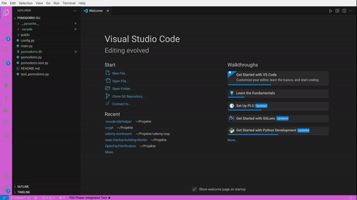

# tdd-helper

This extension helps you focus on Test-Driven-Development by showing you a colored banner in the menubar. The banner indicates where you are in the TDD cycle. You can move from phase to phase using the `TDD Helper: Next Phase`-Command.

## Features

Shows a banner in the menu bar indicating the current phase of a typical TDD cycle:

Outer Cycle:

1. Integration Test

Inner Cycle:

1. Failing Unit Test
2. Implementation
3. Refactor

You can now switch from phase to phase to align to (and remember yourself of) the TDD Cycle. Just use the command `TDD Helper: Next Phase` to go to the next phase or `TDD Helper: New cycle` to start a new feature with an integration test.

## Extension Settings

You can configure the font colors of all phases:

- `tdd-testhelper.integrationTestPhaseColor`
- `tdd-testhelper.unitTestPhaseColor`
- `tdd-testhelper.implementPhaseColor`
- `tdd-testhelper.refactorPhaseColor`

## Release Notes

### 1.0.0

Initial release of the vscode-tdd-helper.

### 1.1.0

Add notification banner.

### 1.2.0

Recolor menubar and statusbar.
